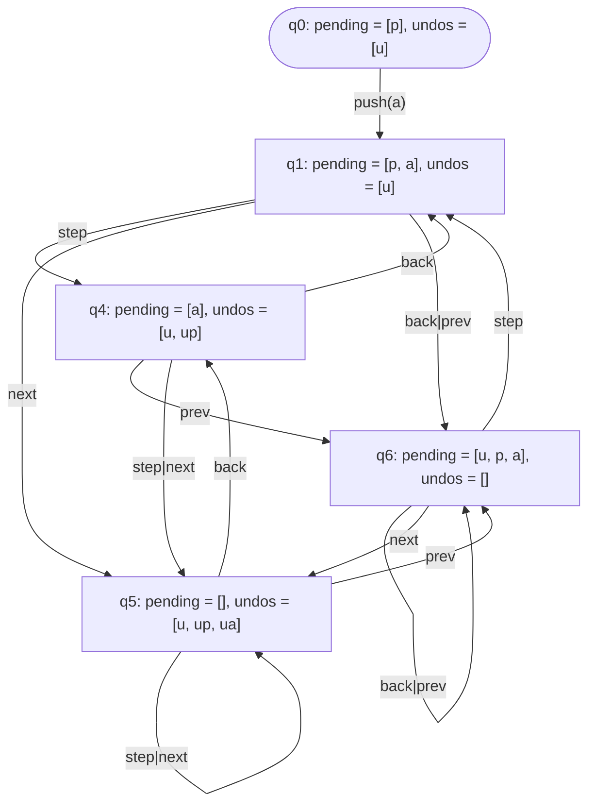

```mermaid
flowchart TD
    q0(["q0: pending = [p], undos = [u]"])
    q1["q1: pending = [p, a], undos = [u]"]
    q4["q4: pending = [a], undos = [u, up]"]
    q5["q5: pending = [], undos = [u, up, ua]"]
    q6["q6: pending = [u, p, a], undos = []"]

    q0-->|"push(a)"| q1

    q1-->|"step"| q4
    q1-->|"next"| q5
    q1-->|"back|prev"| q6

    q4-->|"back"| q1
    q4-->|"prev"| q6
    q4-->|"step|next"| q5

    q5-->|"back"| q4
    q5-->|"prev"| q6
    q5-->|"step|next"| q5

    q6-->|"back|prev"| q6
    q6-->|"step"| q1
    q6-->|"next"| q5
```
